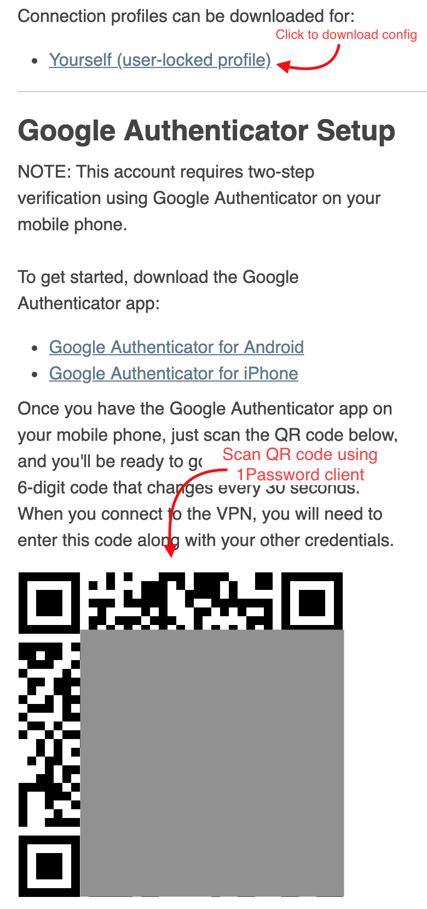
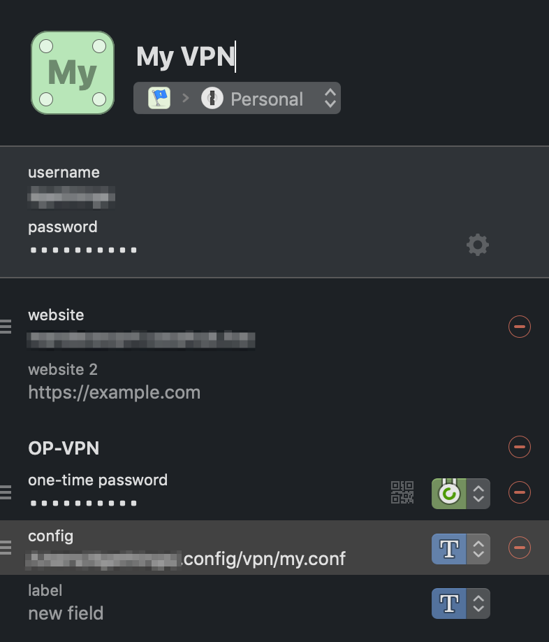

# 1p-vpn

`1p-vpn` is a shell wrapper of OpenVPN CLI with 1Password integration (using 1Password CLI). This provides a complete CLI interface for creating OpenVPN tunnels.

## Usage

To establish a VPN tunnel call the `1p-vpn` script with name of the 1Password login that has the VPN credentials.

```bash
$ 1p-vpn "My VPN"
```

If a `op` session does not already exist it will ask for your 1Password master password. To create the VPN tunnel the script needs root privileges so will ask for your login password too.

To kill the VPN issue `sudo pkill -f "sudo $(brew --prefix openvpn)"`

## Requirements

This script is designed to work on MacOS. It has the following dependencies:

- [brew](https://homebew.sh)
- brew installed `openvpn` (use `brew install openvpn`)
- [jq](https://stedolan.github.io/jq/)
- Bash 5.0+ (MacOS comes with Bash 3.2 so you'll need to upgrade it)
- GNUsed (`brew install gnu-sed`) because OSX's `sed` is rubbish

If you don't install these requirements the script will die horribly.

## Configuration

This script relies on 2 conventions.

First, 1Password login for the VPN must contain the username, password and One Time Password for the VPN connection.

Second, the VPN config file must downloaded and stored locally. It's location must defined in a `config` label in the 1Password login item for that VPN.

The VPN config requires a modification to disable the interactice OTP challenge. This is done with this command:

```bash
$ gsed -i 's/static-challenge/\# static-challenge/g' /path/to/vpn.conf
```

Move the script to some location in your `$PATH`.

```bash
mv 1p-vpn /usr/local/bin
```

## Example Configuration

Log into the OpenVPN web interface. Save the username & password in a 1Password login item. Use a 1Password client (assuming your Mac and iPhone clients are synced you can use iPhone client) to scan the OTP QR code. Also download the VPN client config.



Move the config file and rename it. I use `~/.config/vpn` to store them, but you can put the file anywhere.

You also need to disable the interactive OTP challenge.

```bash
mv ~/Downloads/client.ovpn ~/.config/vpn/my.conf
gsed -i 's/static-challenge/\# static-challenge/g' ~/.config/vpn/my.conf
```

In 1Password add a Section titled "OP-VPN". In that section add a label called "config" and set the field to the path of the config.

Here is what the completed 1Password login item should look like.



After moving the `1p-vpn` script to somewhere in your path you are ready to run it. Just pass the name of the 1Password login item (in this example it is "My VPN") as an argument.

```bash
$ 1p-vpn "My VPN"
Enter the password for xxx@xxx.com at xxx.1password.com:
Password:
ifconfig: ioctl (SIOCDIFADDR): Can't assign requested address
$
```

The `ifconfig` error can be ignored.

Your system is now connected to the VPN!

To disconnect run `sudo pkill -f "sudo $(brew --prefix openvpn)"`
